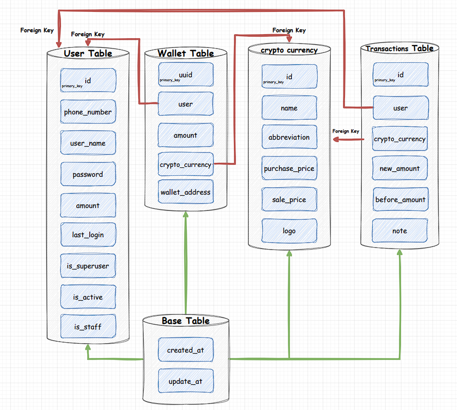
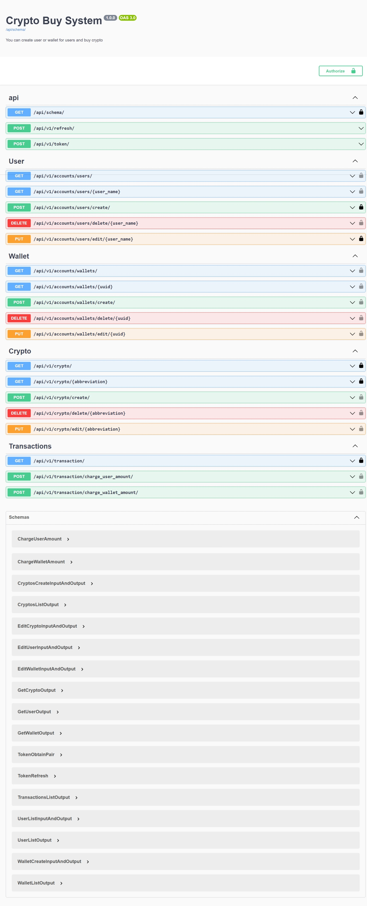

<h1 align="center"/>Crypto Buy System</h1>

<p align="center">
  <a href="https://github.com/houshmand-2005/Crypto_Buy_System" target="_blank">
    
  </a>
</p>

## Table of Contents

- [Overview](#overview)
- [Database](#database)
- [How to run?](#how-to-run)
- [Tests](#tests)
- [APIs list](#apis-list)

# Overview

This is an API project of a crypto currency sales management system.
These APIs provide the ability to create user, create wallet for each user, create cryptos (and manage them) and buy them.

## Database

this is an overview of the database architecture

- Database for test is <b>sqlite</b>
- Database for project is <b>PostgreSQL</b>

<p align="center">
  <a href="https://github.com/houshmand-2005/Crypto_Buy_System" target="_blank">
    
  </a>
</p>

## How to run?

At first you need docker and docker compose
<sub>(first the tests are executed and if the project is successful then project run it completely)</sub>

```bash
# clone the project
git clone https://github.com/houshmand-2005/Crypto_Buy_System
# go to the folder
cd Crypto_Buy_System
# run project with docker
docker-compose up -d
```

## Tests

If you want to run the tests, you only need to do the following steps

```bash
# clone the project
git clone https://github.com/houshmand-2005/Crypto_Buy_System
# go to the folder
cd Crypto_Buy_System
# install the libraries
pip install -r requirements.txt
# now run the tests
python manage.py test
```

## APIs list

This is a list of all APIs available in this project

<p align="center">
  <a href="https://github.com/houshmand-2005/Crypto_Buy_System" target="_blank">
    
  </a>
</p>
